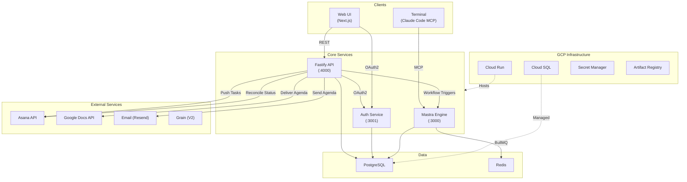
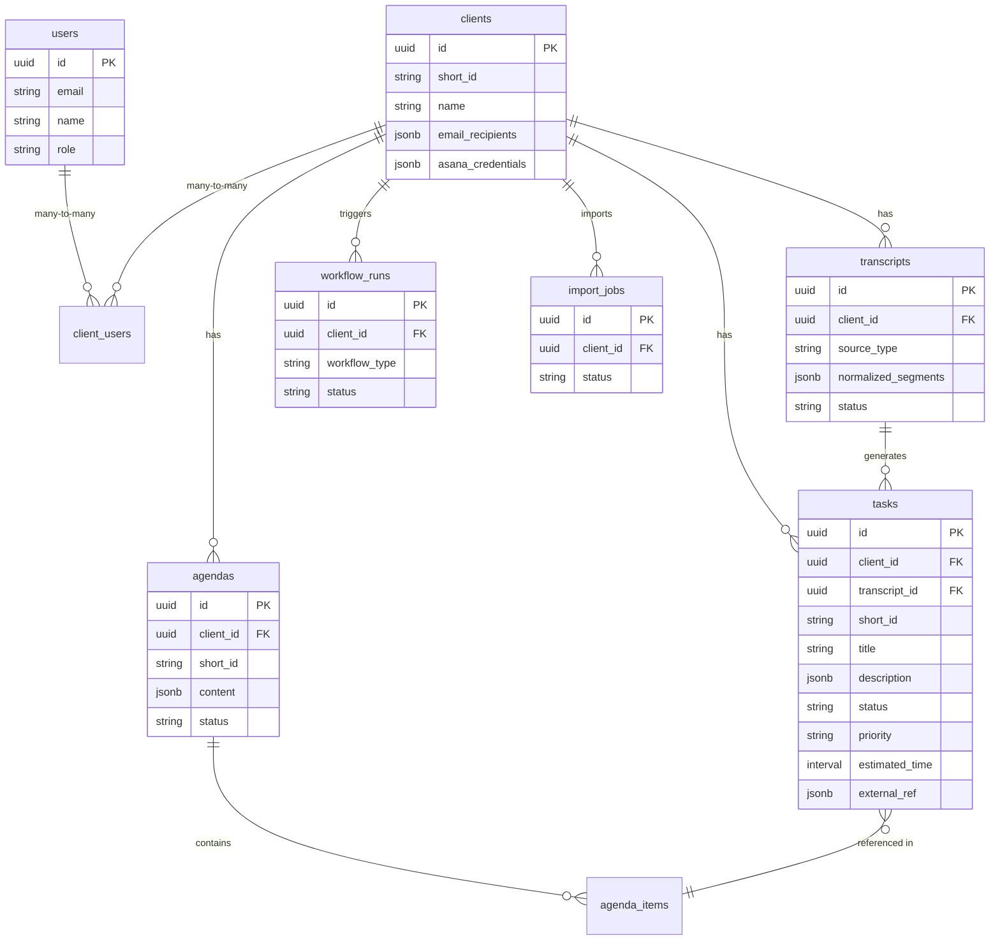

# System Architecture

## High-Level Overview

iExcel Automation is a meeting transcript-to-task automation platform. It ingests meeting transcripts from multiple sources (text, Grain recordings), uses AI agents to extract structured action items, manages task approval workflows, syncs tasks bidirectionally with Asana, and generates meeting agendas delivered via Google Docs and Email.

## Architecture Diagram



## Service Communication

| Source | Target | Protocol | Purpose |
|--------|--------|----------|---------|
| Web UI | API | REST/HTTP | CRUD operations, workflow triggers |
| Web UI | Auth | OAuth2 | User authentication (authorization code flow) |
| Terminal | Mastra | MCP | CLI tool invocations via Claude Code |
| Terminal | Auth | OAuth2 | Device flow authentication |
| API | Auth | HTTP | Token validation, client credentials |
| API | Mastra | REST | Trigger intake/agenda workflows |
| API | Asana | REST | Push tasks, pull status reconciliation |
| API | Google Docs | REST | Deliver agendas as Google Docs |
| API | Email | REST | Send agenda emails via Resend |
| Mastra | Redis | BullMQ | Background job processing |
| Mastra | API | REST | Read/write tasks, transcripts, agendas |

## Database Schema



## Key Processes

### 1. Transcript Intake Pipeline
```
Transcript Upload → Input Normalizer → NormalizedTranscript → DB Storage
    → Workflow Orchestration → Mastra Intake Agent → NormalizedTask[]
    → Batch Task Creation → User Review (UI)
```

### 2. Task Approval & Push
```
User Approves Tasks (UI) → Status: approved → Output Normalizer
    → Asana Push → Status: pushed → external_ref populated
```

### 3. Status Reconciliation
```
Cron/Manual Trigger → Fetch Asana Status → Compare with DB
    → Update internal status (completed) → Cache in Postgres
```

### 4. Agenda Generation Pipeline
```
Trigger Agenda Workflow → Mastra Agenda Agent → ProseMirror JSON
    → Agenda Created in DB → Delivery Adapters (Google Docs / Email)
```

### 5. Authentication Flows
```
Web UI: Authorization Code Flow → Auth Service → JWT (access + refresh)
Terminal: Device Flow → Auth Service → JWT → Token Manager cache
API-to-API: Client Credentials → Auth Service → Service token
```
